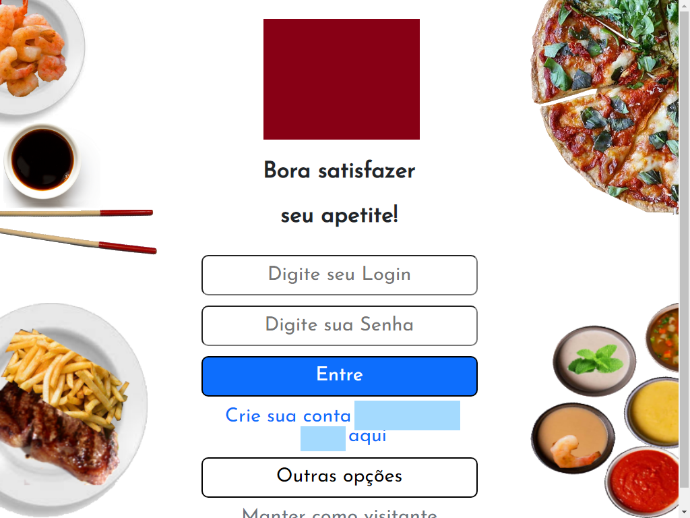

# BORA COMER
**Protótipo de Aplicativo de pedidos in VUE.js**<br>

------------
## REQUISITOS
- servidor amazon aws ec2
- linux server ubunbtu 18.04
- docker
- apache2
- git
- navegador de internet Google Chrome, Mozilla Firefox, Opera, etc...
------------
## CONFIGURANDO DEPLOY KEYS
- Clique em ⚙️ *Settings* na área superior esquerda de seu projeto
- No menu esquerdo clique em 🔑 * *Screts*
- Abaixo aparecerá duas opções clique (*Actions*, *Dependabot*) na opção *Actions*
- No canto esquerdo superior próximo a *Actions secrets* clique no botão ⬜ *New repository secret*
- Preencha todas as chaves
------------
## CHAVES
- AWS_ACCESS_KEY_ID
- AWS_INSTANCE_DNS
- AWS_INSTANCE_ID
- AWS_INSTANCE_IP
- AWS_INSTANCE_LOCAL_IP
- AWS_INSTANCE_SSH_PORT
- AWS_INSTANCE_USER
- AWS_REGION
- AWS_SECRET_ACCESS_KEY
- AWS_SSH_KEY_PEM
------------

## LOCALIZANDO AS CHAVES
- Acesse em seu navegador [https://aws.amazon.com/](https://aws.amazon.com/)
- Faça o login na aws 
-- Caso não tiver a conta basta criar segue um exemplo no vídeo [https://www.youtube.com/watch?v=veq3rnybSyk](https://www.youtube.com/watch?v=veq3rnybSyk) 

### AWS_ACCESS_KEY_ID e AWS_SECRET_ACCESS_KEY
- Clique em seu usuário no canto superior direito e selecione *My Security Credentials*
- Clique em *Usuários* barra lateral esquerda
- Clique no seu usuário
-- Clique caso não tiver no botão azul 🟦 *Adicionar usuários*
- Clique na aba ⬜ *Credenciais de segurança*
- Clique no botão ⬜ *Criar chave de acesso*
- Clique e mostra Credenciais de segurança do usuário 
- De preferencia salve em um arquivo csv
- Segue um exemplo no vídeo (https://www.youtube.com/watch?v=Dy6uShmEYfM)[https://www.youtube.com/watch?v=Dy6uShmEYfM]
------------

### AWS_SSH_KEY_PEM 
- Crie uma instância ec2 de preferência grátis por 1 ano 
-- Segue um exemplo no vídeo (https://www.youtube.com/watch?v=8cDk1QSdt3M)[https://www.youtube.com/watch?v=8cDk1QSdt3M]
-- Se já tiver uma instância para gerar um novo certificado segue a documentação [https://docs.aws.amazon.com/pt_br/AWSEC2/latest/UserGuide/ec2-key-pairs.html](https://docs.aws.amazon.com/pt_br/AWSEC2/latest/UserGuide/ec2-key-pairs.html)
- Configure e salve seu certificado ssh no formato .pem
- Abra o conteudo do certificado .pem em um editor de texto simples como notepad, leaftpad, notepad++, Visual Studio Code, etc...
- Copie o conteudo do certificado e cole na chave *AWS_SSH_KEY_PEM*
------------
### CHAVES DE INSTÂNCIA
- Com o usuário logado
- entre em *ec2*
- *Intâncias*
- Clique na instâcia desejada
- Copie ID de instância para *AWS_INSTANCE_ID*
- Copie Endereço IPv4 público para *AWS_INSTANCE_IP*
- Copie DNS IPv4 público para *AWS_INSTANCE_DNS*
- Copie Endereços IPv4 privados *AWS_INSTANCE_LOCAL_IP*
- Por padrão é 22 copie para *AWS_INSTANCE_SSH_PORT* podendo ser mudado na aba ⬜ *Segurança* em *Grupos de segurança*
- Na aba *Redes* ⬜ Zona de disponibilidade confira com (https://docs.aws.amazon.com/AmazonRDS/latest/UserGuide/Concepts.RegionsAndAvailabilityZones.html)[https://docs.aws.amazon.com/AmazonRDS/latest/UserGuide/Concepts.RegionsAndAvailabilityZones.html] copie o valor para AWS_REGION
- Clique no botão *Conectar* ⬜ procure a caixa de texto *Nome do usuário* copie o valor para *AWS_INSTANCE_USER*
------------

### RODA O FRONT END 
- Clique em *Actios* acima no git hub ▶️
- Em *Workflows* faça o teste de conecção *TestSSHAwsEC2* e *TestAwsEC2*
- Clique em *InstallDockerAwsEC2* para instalar o Docker
- Clique em *CreateContainerDockerAwsEC2* para rodar a aplicação FrontEnd
- Clique em *DestroyContainerDockerAwsEC2* para destruir o projeto atual no servidor aws
- Clique em *DestroyContainerDockerAwsEC2All* para destruir todos os container e imagens
- Clique em *installPrometheusAwsEC2* instalar o prometheus software de monitoramento
- Clique em *removePrometheusAwsEC2* remover o prometheus software de monitoramento

## ITEMS
------------
- Cadastro de Usuário com dados pessoais
- Cadastro de Endereço de entrega do usuário
- Consulta de produtos por grupo (bebidas, pizza, etc.)
- Lançamento de pedidos
------------
Configurar API Rest<br/>
'../untils/until.js'<br/>
```javascript
const serverUrl="http://localhost/";
url backend
bodyRequest:{
		"userAPI": "username",
		"password": "password"
	},
```
demo:<br/>
https://youtu.be/GbIMy1RxY8A

